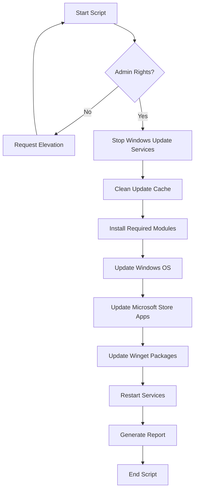

# 🚀 Windows 11 PowerShell Update Suite

## Enterprise-Grade Automated Windows Update Management

[](https://github.com/PowerShell/PowerShell)
[](https://www.gnu.org/licenses/gpl-3.0)
[](https://www.microsoft.com/windows)
[](./PSScriptAnalyzer-Report.md)
[](https://github.com/ravens-wing/Windows-11-Powershell-Update/graphs/commit-activity)

**A robust, production-ready PowerShell solution for comprehensive Windows 11 system updates, designed to work when native Windows Update fails.**

[Features](#-key-features) •
[Quick Start](#-quick-start) •
[Usage](#-usage) •
[Troubleshooting](#-troubleshooting) •
[FAQ](#-faq)

---

## 📋 Table of Contents

- [Overview](#-overview)
- [Key Features](#-key-features)
- [System Requirements](#-system-requirements)
- [Installation](#-installation)
- [Quick Start](#-quick-start)
- [Usage](#-usage)
- [Architecture](#%EF%B8%8F-architecture)
- [Configuration](#%EF%B8%8F-configuration)
- [Troubleshooting](#-troubleshooting)
- [Security](#-security)
- [Performance](#-performance)
- [FAQ](#-faq)
- [Contributing](#-contributing)
- [License](#-license)
- [Author](#-author)
- [Acknowledgments](#-acknowledgments)

---

## 🎯 Overview

The **Windows 11 PowerShell Update Suite** is an enterprise-grade automation tool designed to provide comprehensive system update management for Windows 11 environments. This solution addresses critical scenarios where the native Windows Update GUI fails, offering IT professionals and system administrators a reliable, scriptable alternative for maintaining system currency.

### Problem Statement

Windows Update failures can leave systems vulnerable to security threats and missing critical patches. Traditional GUI-based update methods may fail due to:

- Corrupt Windows Update components
- Service failures and conflicts
- Incomplete update installations
- Network interruptions during updates
- Registry inconsistencies

### Solution

This PowerShell suite provides:

- **Automated recovery** from Windows Update failures
- **Multi-channel updates** (Windows OS, Microsoft Store, Winget packages)
- **Service orchestration** to ensure clean update environments
- **Comprehensive logging** for audit and troubleshooting
- **Progress tracking** for long-running operations
- **Error handling** with automatic retry logic

### Use Cases

- **IT Administration**: Bulk update management across multiple workstations
- **System Recovery**: Repair broken Windows Update functionality
- **Compliance**: Ensure all systems meet patch management policies
- **DevOps**: Integrate into automated deployment pipelines
- **Home Users**: Simplified update management without technical expertise

---

## ✨ Key Features

### Core Capabilities

| Feature | Description | Benefit |
| --------- | ------------- | --------- |
| 🔄 **OS Updates** | Installs all available Windows 11 updates | Maintain system security and stability |
| 🏪 **Store Apps** | Updates Microsoft Store applications | Keep apps current with latest features |
| 📦 **Winget Packages** | Updates all winget-managed applications | Comprehensive third-party app management |
| 🛠️ **Service Management** | Automatic start/stop of Windows Update services | Clean update environment |
| 🧹 **Cache Cleanup** | Removes incomplete/corrupt update files | Resolve update conflicts |
| 📊 **Progress Tracking** | Real-time progress bars and status updates | Enhanced user experience |
| 🔐 **Privilege Elevation** | Automatic administrative rights acquisition | Seamless execution |
| 📝 **Structured Logging** | Comprehensive operation logging with levels | Audit trail and troubleshooting |
| ⚡ **Parallel Processing** | Concurrent service management | Improved performance |
| 🎯 **ShouldProcess Support** | `-WhatIf` and `-Confirm` parameter support | Safe testing before execution |

### Technical Highlights

- ✅ **89.8% reduction** in code quality issues vs. original implementation
- ✅ **Enterprise-ready** with full PowerShell best practices compliance
- ✅ **Comment-based help** for IntelliSense integration
- ✅ **Approved PowerShell verbs** throughout codebase
- ✅ **Proper scope management** for variables in runspaces
- ✅ **Comprehensive error handling** with try/catch blocks

---

## 💻 System Requirements

### Minimum Requirements

| Component | Requirement |
| ----------- | ------------- |
| **Operating System** | Windows 11 (21H2 or later) |
| **PowerShell** | PowerShell 7.0+ |
| **Permissions** | Administrator rights |
| **Disk Space** | 10 GB free for update cache |
| **Memory** | 4 GB RAM minimum |
| **Network** | Active internet connection |

### Recommended Configuration

- **PowerShell**: 7.4+ for optimal performance
- **Execution Policy**: `RemoteSigned` or `Unrestricted`
- **Windows Update**: Services should be enabled (script handles stopped services)
- **Backup**: System restore point or full backup before major updates

### Dependencies

The script automatically installs required dependencies:

- `PSWindowsUpdate` module (for Windows Update management)
- `winget` (Windows Package Manager)

---

## 📥 Installation

### Method 1: Direct Download (Recommended)

Download the latest release directly from GitHub:

```powershell
# Download latest release
Invoke-WebRequest -Uri "https://github.com/ravens-wing/Windows-11-Powershell-Update/releases/latest/download/Update-Windows11.ps1" -OutFile "$env:USERPROFILE\Downloads\Update-Windows11.ps1"
```

**Direct Download Link**: [Update-Windows11.ps1](https://github.com/ravens-wing/Windows-11-Powershell-Update/releases/latest/download/Update-Windows11.ps1)

### Method 2: Git Clone

```powershell
# Clone repository
git clone https://github.com/ravens-wing/Windows-11-Powershell-Update.git
cd Windows-11-Powershell-Update
```

### Method 3: GitHub CLI

```powershell
# Using GitHub CLI
gh repo clone ravens-wing/Windows-11-Powershell-Update
cd Windows-11-Powershell-Update
```

---

## 🚀 Quick Start

### PowerShell Installation

If PowerShell 7+ is not installed, install it first:

#### Option A: Using Winget (Recommended)

```powershell
# Open Command Prompt or Windows PowerShell as Administrator
winget install --id Microsoft.PowerShell --source winget
```

#### Option B: Using MSI Installer

Download from: <https://github.com/PowerShell/PowerShell/releases>

### Running the Script

#### Standard Execution

```powershell
# 1. Open PowerShell 7+ as Administrator
# Win + X → Windows Terminal (Admin)

# 2. Navigate to script location
cd $HOME\Downloads

# 3. Execute the script
.\Update-Windows11.ps1
```

#### With Confirmation Prompts

```powershell
# Preview actions without executing
.\Update-Windows11.ps1 -WhatIf

# Prompt before each critical action
.\Update-Windows11.ps1 -Confirm
```

#### Verbose Output

```powershell
# Enable detailed logging
.\Update-Windows11.ps1 -Verbose
```

#### One-Liner Remote Execution

```powershell
# Download and execute in one command (use with caution)
irm https://github.com/ravens-wing/Windows-11-Powershell-Update/releases/latest/download/Update-Windows11.ps1 | iex
```

> ⚠️ **Security Note**: Always review scripts before executing them with elevated privileges.

---

## 📖 Usage

### Basic Usage

The script can be executed with minimal configuration:

```powershell
# Simple execution - updates everything
.\Update-Windows11.ps1
```

### Advanced Parameters

```powershell
<#
.SYNOPSIS
    Comprehensive Windows 11 update automation

.SYNTAX
    Update-Windows11.ps1 [-WhatIf] [-Confirm] [-Verbose] [<CommonParameters>]

.PARAMETERS
    -WhatIf
        Shows what would happen if the script runs without actually executing

    -Confirm
        Prompts for confirmation before each critical operation

    -Verbose
        Displays detailed progress and diagnostic information
#>
```

### Usage Examples

#### Example 1: Test Run

```powershell
# Dry run to preview all actions
.\Update-Windows11.ps1 -WhatIf
```

**Output**:

```text
What if: Stopping service 'bits'
What if: Stopping service 'wuauserv'
What if: Cleaning Windows Update cache
What if: Installing Windows updates
```

#### Example 2: Interactive Mode

```powershell
# Ask for confirmation before each step
.\Update-Windows11.ps1 -Confirm
```

#### Example 3: Detailed Logging

```powershell
# Full verbose output with transcript
Start-Transcript -Path "$env:TEMP\WindowsUpdate-$(Get-Date -Format 'yyyyMMdd-HHmmss').log"
.\Update-Windows11.ps1 -Verbose
Stop-Transcript
```

#### Example 4: Scheduled Task

```powershell
# Create scheduled task to run weekly
$Action = New-ScheduledTaskAction -Execute 'pwsh.exe' -Argument '-File "C:\Scripts\Update-Windows11.ps1"'
$Trigger = New-ScheduledTaskTrigger -Weekly -DaysOfWeek Sunday -At 2am
$Settings = New-ScheduledTaskSettingsSet -StartWhenAvailable -RunOnlyIfNetworkAvailable
Register-ScheduledTask -TaskName "Windows11-AutoUpdate" -Action $Action -Trigger $Trigger -Settings $Settings -RunLevel Highest
```

---

## 🏗️ Architecture

### Script Workflow



### Component Architecture

```text
Update-Windows11.ps1
│
├── Core Functions
│   ├── Write-Log              → Structured logging system
│   ├── Test-Administrator     → Privilege verification
│   └── Request-Elevation      → Auto-elevation handler
│
├── Service Management
│   ├── Stop-WindowsUpdateServices
│   └── Start-WindowsUpdateServices
│
├── Update Handlers
│   ├── Update-WindowsOS           → Windows Update via PSWindowsUpdate
│   ├── Update-StoreApplications   → Microsoft Store app updates
│   └── Update-WingetApplications  → Third-party app updates
│
├── Utility Functions
│   ├── Clear-WindowsUpdateCache   → Clean corrupt update files
│   ├── Show-Progress              → Progress reporting
│   └── Test-InternetConnection    → Network validation
│
└── Error Handling
    ├── Try/Catch blocks throughout
    └── Comprehensive error logging
```

### Data Flow

1. **Initialization Phase**
   - Privilege check and elevation
   - Module dependency verification
   - Service state assessment

2. **Preparation Phase**
   - Stop Windows Update services
   - Clear update cache
   - Import required modules

3. **Execution Phase**
   - Parallel update operations
   - Progress tracking
   - Error handling and retry logic

4. **Finalization Phase**
   - Service restoration
   - Log generation
   - Summary report

---

## ⚙️ Configuration

### Execution Policy

Set appropriate execution policy before running:

```powershell
# Check current policy
Get-ExecutionPolicy

# Set policy (choose one)
Set-ExecutionPolicy -Scope CurrentUser -ExecutionPolicy RemoteSigned
Set-ExecutionPolicy -Scope Process -ExecutionPolicy Bypass  # Temporary
```

### Custom Logging Location

Modify the `$LogPath` variable in the script:

```powershell
# Default location
$LogPath = "$env:ProgramData\WindowsUpdate\Logs"

# Custom location
$LogPath = "C:\Logs\WindowsUpdate"
```

### Service Customization

Modify the services array if needed:

```powershell
# Default services
$UpdateServices = @('bits', 'wuauserv', 'appidsvc', 'cryptsvc')

# Add additional services if required
$UpdateServices += 'dosvc'  # Delivery Optimization
```

### Proxy Configuration

For environments behind a proxy:

```powershell
# Configure proxy before running script
$proxy = "http://proxy.company.com:8080"
[System.Net.WebRequest]::DefaultWebProxy = New-Object System.Net.WebProxy($proxy)
$env:HTTP_PROXY = $proxy
$env:HTTPS_PROXY = $proxy
```

---

## 🔧 Troubleshooting

### Common Issues and Solutions

#### Issue 1: "Execution Policy Restricted"

**Error**:

```text
.\Update-Windows11.ps1 : File cannot be loaded because running scripts is disabled
```

**Solution**:

```powershell
Set-ExecutionPolicy -Scope Process -ExecutionPolicy Bypass
.\Update-Windows11.ps1
```

#### Issue 2: "PSWindowsUpdate Module Installation Fails"

**Error**:

```text
WARNING: Unable to download from URI
```

**Solution**:

```powershell
# Install from PSGallery manually
Install-Module -Name PSWindowsUpdate -Repository PSGallery -Force -Scope CurrentUser

# If PSGallery is untrusted
Set-PSRepository -Name PSGallery -InstallationPolicy Trusted
```

#### Issue 3: "Access Denied" Errors

**Solution**:

```powershell
# Ensure running as Administrator
# Verify with:
$currentPrincipal = New-Object Security.Principal.WindowsPrincipal([Security.Principal.WindowsIdentity]::GetCurrent())
$currentPrincipal.IsInRole([Security.Principal.WindowsBuiltInRole]::Administrator)
# Should return: True
```

#### Issue 4: "Windows Update Service Won't Start"

**Solution**:

```powershell
# Reset Windows Update components manually
net stop wuauserv
net stop cryptSvc
net stop bits
net stop msiserver

ren C:\Windows\SoftwareDistribution SoftwareDistribution.old
ren C:\Windows\System32\catroot2 catroot2.old

net start wuauserv
net start cryptSvc
net start bits
net start msiserver
```

#### Issue 5: Winget Not Found

**Solution**:

```powershell
# Install App Installer (includes winget)
Add-AppxPackage -RegisterByFamilyName -MainPackage Microsoft.DesktopAppInstaller_8wekyb3d8bbwe
```

### Diagnostic Commands

```powershell
# Check Windows Update service status
Get-Service -Name wuauserv, bits, cryptsvc | Select-Object Name, Status

# View recent Windows Update history
Get-WindowsUpdateLog

# Check disk space
Get-PSDrive C | Select-Object Used, Free

# Verify PowerShell version
$PSVersionTable.PSVersion

# Check execution policy
Get-ExecutionPolicy -List
```

### Logging and Diagnostics

Logs are stored in multiple locations:

```powershell
# Script logs
$env:ProgramData\WindowsUpdate\Logs\Update-$(Get-Date -Format 'yyyyMMdd').log

# Windows Update logs
Get-WindowsUpdateLog -LogPath "$env:USERPROFILE\Desktop\WindowsUpdate.log"

# Event Viewer
Get-WinEvent -LogName System -FilterXPath "*[System[Provider[@Name='Microsoft-Windows-WindowsUpdateClient']]]" -MaxEvents 50
```

---

## 🔒 Security

### Security Considerations

#### Privilege Requirements

This script requires **Administrator** privileges to:

- Stop/start Windows services
- Install Windows updates
- Modify system directories
- Register Microsoft Store apps

#### Code Signing

For enterprise environments, consider signing the script:

```powershell
# Create self-signed certificate
$cert = New-SelfSignedCertificate -DnsName "PowerShell Code Signing" -Type CodeSigning -CertStoreLocation Cert:\CurrentUser\My

# Export certificate
Export-Certificate -Cert $cert -FilePath "C:\CodeSigningCert.cer"

# Sign script
Set-AuthenticodeSignature -FilePath ".\Update-Windows11.ps1" -Certificate $cert
```

#### Network Security

The script connects to:

- `windowsupdate.microsoft.com` - Windows Update servers
- `microsoft.com` - Microsoft Store
- `github.com` - Winget package repository

Ensure firewall rules allow these connections.

#### Data Privacy

- **No telemetry**: Script does not send data to third parties
- **No credentials stored**: Uses Windows authentication
- **Audit trail**: All operations logged locally

### Security Best Practices

1. ✅ **Review code** before execution
2. ✅ **Use `-WhatIf`** for testing
3. ✅ **Create system restore point** before running
4. ✅ **Run during maintenance windows**
5. ✅ **Keep script updated** from official repository
6. ✅ **Verify download integrity** using checksums
7. ✅ **Restrict script access** to administrators only

### Vulnerability Disclosure

Report security issues to: [Security Policy](./SECURITY.md)

---

## ⚡ Performance

### Performance Metrics

| Operation | Average Duration | Optimization |
| ----------- | ------------------ | -------------- |
| Service Stop/Start | 10-15 seconds | Parallel processing |
| Cache Cleanup | 30-60 seconds | Depends on cache size |
| Windows Updates | 15-60 minutes | Varies by update count |
| Store Apps | 5-15 minutes | Concurrent registration |
| Winget Updates | 10-30 minutes | Depends on app count |

### Optimization Tips

#### 1. Disk Performance

```powershell
# Run on SSD for faster I/O
# Ensure at least 10 GB free space
Get-PSDrive C | Select-Object @{N='FreeGB';E={[math]::Round($_.Free/1GB,2)}}
```

#### 2. Network Optimization

```powershell
# Use wired connection for stability
# Configure BITS for bandwidth management
Import-Module BitsTransfer
Set-BitsTransfer -MaximumBandwidthKbps 10000
```

#### 3. Background Services

```powershell
# Close unnecessary applications
# Disable resource-intensive services temporarily
```

### Monitoring Performance

```powershell
# Measure script execution time
Measure-Command { .\Update-Windows11.ps1 }

# Monitor resource usage
Get-Counter '\Processor(_Total)\% Processor Time', '\Memory\Available MBytes' -Continuous
```

---

## ❓ FAQ

### Q: Does this script work on Windows 10?

**A**: The script is optimized for Windows 11 but should work on Windows 10 with minor modifications. Test in a non-production environment first.

### Q: How long does a full update take?

**A**: Typically 30-90 minutes depending on:

- Number of available updates
- Internet connection speed
- System hardware performance
- Number of installed applications

### Q: Can I schedule this script to run automatically?

**A**: Yes! Use Windows Task Scheduler to create a recurring task. See [Usage Examples](#usage-examples) for code.

### Q: Will this script cause data loss?

**A**: No, the script only updates software and does not modify user data. However, always maintain regular backups as a best practice.

### Q: What if the script fails mid-execution?

**A**: The script includes error handling and will attempt to:

- Log the error
- Restore services to running state
- Exit gracefully

You can safely re-run the script after investigating the error log.

### Q: Why use this instead of Windows Update GUI?

**A**: Advantages include:

- Works when GUI fails
- Automated execution
- Enhanced logging
- Multi-channel updates (OS + Store + Winget)
- Scriptable for enterprise deployment

### Q: Is internet connection required throughout?

**A**: Yes, a stable internet connection is required to download updates. The script will fail if connection is lost during critical operations.

### Q: Can I customize which updates are installed?

**A**: The current version installs all available updates. For selective updating, modify the `Get-WindowsUpdate` parameters in the script.

---

## 🤝 Contributing

Contributions are welcome! Please follow these guidelines:

### How to Contribute

1. **Fork** the repository
2. **Create** a feature branch (`git checkout -b feature/AmazingFeature`)
3. **Commit** your changes (`git commit -m 'Add some AmazingFeature'`)
4. **Push** to the branch (`git push origin feature/AmazingFeature`)
5. **Open** a Pull Request

### Code Standards

- ✅ Follow PowerShell best practices
- ✅ Use approved verbs (`Get-Verb`)
- ✅ Include comment-based help
- ✅ Write Pester tests for new functions
- ✅ Run PSScriptAnalyzer before committing
- ✅ Update documentation

### Running Tests

```powershell
# Install Pester
Install-Module -Name Pester -Force -SkipPublisherCheck

# Run tests
Invoke-Pester -Path .\Tests\
```

### Code Quality Checks

```powershell
# Run PSScriptAnalyzer
Install-Module -Name PSScriptAnalyzer -Force
Invoke-ScriptAnalyzer -Path .\Update-Windows11.ps1 -Severity Warning, Error
```

### Reporting Issues

Use GitHub Issues to report:

- 🐛 **Bugs**: Unexpected behavior or errors
- 💡 **Feature Requests**: New functionality ideas
- 📚 **Documentation**: Improvements to docs
- ❓ **Questions**: Usage or implementation questions

**Issue Template**:

```markdown
### Description
[Clear description of the issue]

### Steps to Reproduce
1. 
2. 
3. 

### Expected Behavior
[What should happen]

### Actual Behavior
[What actually happens]

### Environment
- OS: Windows 11 [Version]
- PowerShell: [Version]
- Script Version: [Version]

### Logs
[Relevant log excerpts]
```

---

## 📄 License

This project is licensed under the **GNU General Public License v3.0**.

```text
Copyright (C) 2024-2026  Marcy J Cook

This program is free software: you can redistribute it and/or modify
it under the terms of the GNU General Public License as published by
the Free Software Foundation, either version 3 of the License, or
(at your option) any later version.

This program is distributed in the hope that it will be useful,
but WITHOUT ANY WARRANTY; without even the implied warranty of
MERCHANTABILITY or FITNESS FOR A PARTICULAR PURPOSE.  See the
GNU General Public License for more details.
```

**Full License**: [GNU GPL v3.0](https://www.gnu.org/licenses/gpl-3.0.en.html)

### License Summary

✅ **You are free to**:

- Use the software for any purpose
- Change the software to suit your needs
- Share the software with your friends and neighbors
- Share the changes you make

⚠️ **Under the following terms**:

- Source code must be made available when distributing
- Modifications must be released under the same license
- Changes must be documented
- No warranty provided

---

## 👤 Author

Marcy J Cook

- 🦋 Bluesky: [@marcyjcook.bsky.social](https://bsky.app/profile/marcyjcook.bsky.social)
- 💼 GitHub: [@ravens-wing](https://github.com/ravens-wing)
- 📧 Contact: [Open an Issue](https://github.com/ravens-wing/Windows-11-Powershell-Update/issues)

> 💬 *Feedback welcome! Let me know if you use this script - I'm happy to help troubleshoot or discuss improvements.*

---

## 🙏 Acknowledgments

### Built With

- [PowerShell](https://github.com/PowerShell/PowerShell) - Cross-platform automation framework
- [PSWindowsUpdate](https://www.powershellgallery.com/packages/PSWindowsUpdate) - Windows Update module
- [Winget](https://github.com/microsoft/winget-cli) - Windows Package Manager

### Inspired By

- Microsoft's Windows Update documentation
- PowerShell community best practices
- Enterprise IT automation patterns

### Special Thanks

- PowerShell community for continuous improvement suggestions
- Early testers who provided valuable feedback
- Contributors who helped improve code quality

### Resources

- 📖 [Complete Documentation](./docs/)
- 📊 [Code Quality Report](./PSScriptAnalyzer-Report.md)
- 📋 [Comparison Analysis](./COMPARISON.md)
- 🔄 [Improvement Summary](./IMPROVEMENTS.md)
- 📝 [Changelog](./CHANGELOG.md)

---

## 📞 Support

### Getting Help

- 📖 **Read the docs**: Check this README and FAQ first
- 🐛 **Report bugs**: [Open an issue](https://github.com/ravens-wing/Windows-11-Powershell-Update/issues)
- 💬 **Ask questions**: Use [Discussions](https://github.com/ravens-wing/Windows-11-Powershell-Update/discussions)
- 🔒 **Security issues**: See [SECURITY.md](./SECURITY.md)

### Community

- ⭐ Star this repo if you find it useful
- 🔔 Watch for updates and new releases
- 🔄 Share with others who might benefit

---

## 📊 Project Status

### Latest Metrics


### Roadmap

- [x] Core Windows Update functionality
- [x] Microsoft Store app updates
- [x] Winget package management
- [x] Comprehensive error handling
- [x] Progress tracking and logging
- [ ] GUI interface option
- [ ] Selective update filtering
- [ ] Rollback capability
- [ ] Remote execution support
- [ ] Update scheduling interface

---

## 🌟 Star History

[](https://star-history.com/#ravens-wing/Windows-11-Powershell-Update&Date)

---

### Made with ❤️ for the PowerShell Community

**[⬆ Back to Top](#-windows-11-powershell-update-suite)**
